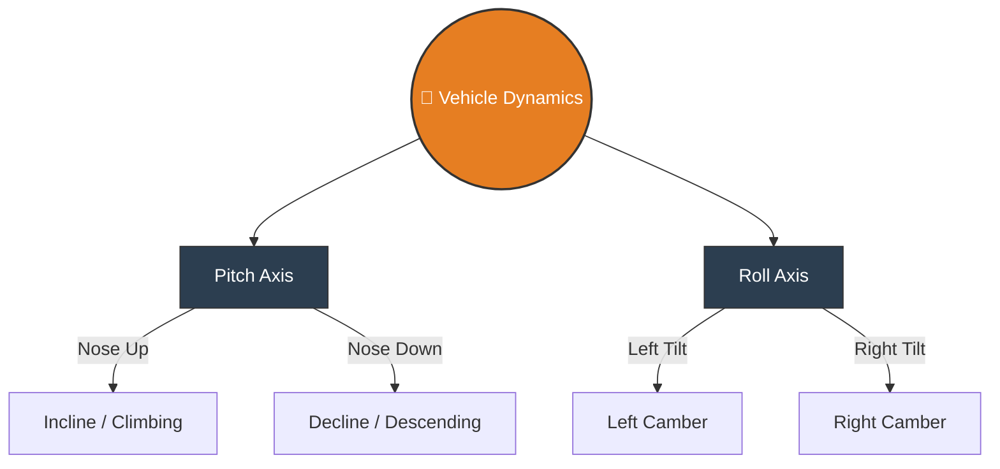
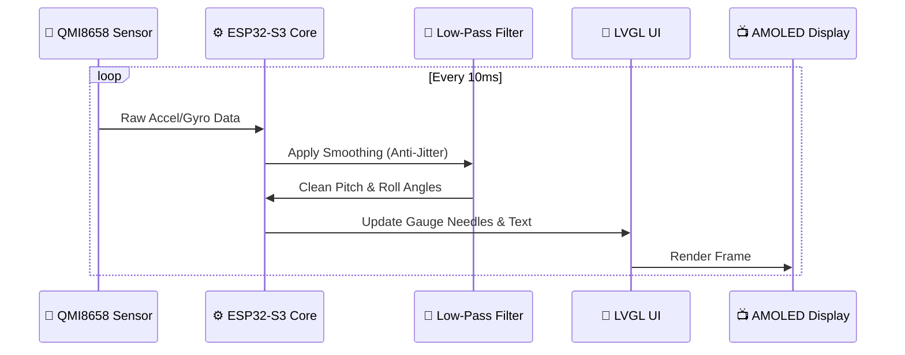

# 🚙 JimnyUnlimited: Digital AMOLED Inclinometer

A high-performance, real-time digital inclinometer built for off-road vehicles and 4x4s. Designed specifically for the **Waveshare ESP32-S3-Touch-AMOLED-1.43**, this firmware utilizes the onboard 6-axis IMU to provide buttery-smooth pitch and roll telemetry on a crisp, sunlight-readable AMOLED display.

---

## ✨ Features
* **⛰️ Real-Time Pitch & Roll:** Instantaneous vehicle angle monitoring for safe off-roading and overlanding.
* **🏎️ 60FPS AMOLED UI:** Built with LVGL for fluid, high-framerate animations and zero screen tearing.
* **🎛️ Onboard IMU Processing:** Directly reads from the Waveshare's built-in 6-axis gyroscope/accelerometer (QMI8658).
* **🎯 Touch Calibration:** Simple touchscreen interface to zero-out the sensors when parked on level ground.
* **🌙 Dark Mode Optimized:** Deep AMOLED blacks reduce cabin glare during night driving.

---

## 🛠️ Hardware Requirements
* **Board:** [Waveshare ESP32-S3-Touch-AMOLED-1.43](https://www.waveshare.com/esp32-s3-touch-amoled-1.43.htm)
* **Mounting:** 3D Printed dashboard pod or standard gauge cup (1.43" circular).
* **Power:** 5V USB-C or hardwired 12V-to-5V step-down converter.

---

## ⚙️ Arduino IDE Board Settings
To compile this project successfully and ensure the LVGL graphics run smoothly, configure your Arduino IDE with the following settings:

Go to **Tools** and set the following parameters:

| Setting | Value |
| :--- | :--- |
| **Board** | `ESP32S3 Dev Module` |
| **USB CDC On Boot** | `Enabled` |
| **Flash Size** | `16MB (128Mb)` |
| **Partition Scheme** | `16M Flash (3MB APP/9MB FATFS)` *(Leaves room for future UI assets)* |
| **PSRAM** | `OPI PSRAM` |

*Note: PSRAM must be set to `OPI PSRAM` or the display buffer will fail to allocate, resulting in a blank screen.*

---

## 📖 User Guide

### 1. Vehicle Axis & Telemetry
The inclinometer measures two primary angles critical for off-road safety:

### 2. Sensor Data Architecture
The firmware uses a lightweight filtering system to prevent the UI from jittering due to engine vibrations or bumpy trails.

### 3. Calibration (Zeroing the Gauge)
Because dashboard angles differ between vehicles, you must calibrate the device after installation:
1. Park your vehicle on a **perfectly flat, level surface**.
2. Power on the inclinometer.
3. **Long-press** the center of the touchscreen for 3 seconds.
4. The screen will flash, and the current angles will be set as the new `0°` baseline.
5. These calibration offsets are saved to the ESP32's non-volatile memory (NVS) and will persist even if the battery is disconnected.

---

## 🔧 Troubleshooting

* **Screen is completely black on boot:** 
  Ensure `PSRAM` is set to `OPI PSRAM` in the Arduino Tools menu. The AMOLED driver requires PSRAM to allocate the frame buffers.
* **Angles are jittery or jumping around:**
  Ensure the device is rigidly mounted to the dashboard. Loose mounts will amplify engine vibrations. 
* **Pitch and Roll are swapped:**
  Depending on how you mounted the screen (USB port facing down vs. sideways), the X and Y axes might be inverted. You can swap these in the `config.h` file by changing `#define SWAP_AXES true`.

---
*Built for the trails. Keep the rubber side down!* 🚙💨